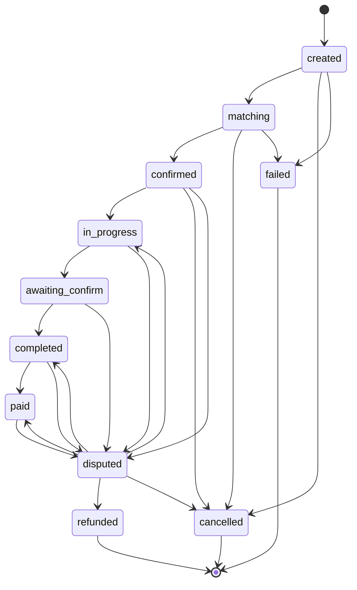

# 服務工作流契約

## 適用範圍

本契約適用於平台上**所有服務**。新增服務時必須遵循本契約，不得為個別服務開例外。

目前已註冊服務：
- `repair_maintenance` — 水電維修（第一個實作）

## 核心原則

1. **一個服務 = 一條獨立 workflow**（一條 Step Functions state machine）
2. **服務差異寫在 Manifest**（宣告式資料），不寫在路由器或共用元件的條件判斷中
3. **共用能力以呼叫方式使用**，各 workflow 不得複製實作
4. **對外狀態統一，內部狀態自由** — APP 端不得為個別服務撰寫專屬狀態顯示邏輯

## 通用對外狀態

所有服務對外只暴露以下狀態。

### 正常狀態

| 狀態 | 語意 |
|---|---|
| `created` | 請求已建立，尚未開始媒合服務提供者 |
| `matching` | 正在媒合服務提供者，或已產生候選清單待住戶選擇，或住戶已選擇但服務提供者尚未確認 |
| `confirmed` | 住戶與服務提供者雙方均已確認，服務提供者已鎖定 |
| `in_progress` | 服務執行中 |
| `awaiting_confirm` | 服務提供者宣告完成，等待住戶確認 |
| `completed` | 住戶確認完成，或逾時自動確認 |
| `paid` | 付款完成。非終態，付款後仍可因售後問題進入 `disputed` |

### 例外狀態

| 狀態 | 語意 |
|---|---|
| `cancelled` | 已取消（終態） |
| `disputed` | 爭議處理中 |
| `refunded` | 已退款（終態） |
| `failed` | 系統性失敗且無法繼續（終態） |

## 合法狀態轉換



僅上述轉換為合法。任何其他轉換請求必須被拒絕，且訂單保持原狀態。

### 終態

終態為 `cancelled`、`refunded` 與 `failed`。終態不得轉出任何狀態。

`paid` **不是終態**。付款完成後仍可因售後問題進入 `disputed`。爭議裁定結果決定後續狀態：裁定重新履約轉為 `in_progress`、裁定退款轉為 `refunded`、裁定爭議不成立則回到進入 `disputed` 前的狀態（付款前爭議回到 `completed`，付款後爭議回到 `paid`）。金流的最終結束點為 `paid` 且售後爭議受理期限已屆至，或 `refunded`。

各服務可於 Manifest 的 `state_timeouts` 宣告 `paid` 狀態的售後爭議受理期限，逾期後該服務不再受理該請求的爭議。

### 取消規則

- 住戶可於 `created` 與 `matching` 自行取消
- `confirmed` 之後不可自行取消，必須走 `disputed` 流程

## 狀態映射規則

每個服務定義自己的內部狀態，並在 Manifest 中宣告 `state_mapping`。映射必須滿足：

1. **全函數** — 每個內部狀態恰好對應一個通用狀態
2. **覆蓋性** — 每個通用正常狀態至少被一個內部狀態覆蓋
3. **終態封閉** — 映射到終態的內部狀態不得有後續轉換

### 內部狀態轉換

內部狀態轉換若映射到同一個通用狀態，視為通用狀態未變更，**不需通過合法轉換邊檢查**，但仍須寫入審計紀錄。

例如水電垂直中商家逾時未確認，內部狀態由 `vendor_selected` 退回 `quotes_received`，兩者皆映射到 `matching`，因此不構成通用狀態轉換。合法轉換邊檢查僅套用於通用狀態發生實際變更時。

範例（`repair_maintenance`）：

| 內部狀態 | 通用狀態 |
|---|---|
| `pending_quotes` | `created` |
| `quotes_received` | `matching` |
| `vendor_selected` | `matching` |
| `vendor_confirmed` | `confirmed` |
| `in_progress` | `in_progress` |
| `awaiting_acceptance` | `awaiting_confirm` |
| `completed` | `completed` |
| `paid` | `paid` |

## Service Manifest

每個服務以宣告式 Manifest 註冊，存放於 `config/services/{service_id}.yaml`，並同步至 Service Registry。

```yaml
service_id: repair_maintenance
display_name: 水電維修
is_active: true
state_machine_arn: "arn:aws:states:ap-northeast-1:...:wf-repair-order:LIVE"

intent_examples:
  - 浴室水管破裂在漏水
  - 插座沒電了
  - 天花板一直滴水
not_this_service:
  - 我要買水管零件
  - 冷氣不冷

required_slots: [district, service_category, urgency, estimated_hours]
optional_slots: [preferred_time_window, building_age]

state_mapping:
  pending_quotes: created
  quotes_received: matching
  vendor_selected: matching
  vendor_confirmed: confirmed
  in_progress: in_progress
  awaiting_acceptance: awaiting_confirm
  completed: completed
  paid: paid

state_timeouts:
  matching: { seconds: 86400, on_timeout: return_to_matching_and_notify }
  awaiting_confirm: { seconds: 604800, on_timeout: auto_complete }

matching_strategy: competitive_bidding
pricing_strategy: market_range_bidding
verification_strategy: baseline_vs_result_image

disclosure_policy:
  to_provider: [resident_full_name, resident_phone, resident_address]
  to_resident: [provider_name, provider_phone]

pii_class: general
human_checkpoint_required: false
min_confidence: 0.75
```

### 註冊驗證

Platform 在服務註冊時必須驗證，任一項失敗即拒絕註冊：

- `state_mapping` 為全函數且覆蓋所有通用正常狀態
- `required_slots` 不得為空
- `state_machine_arn` 存在且可啟動
- `intent_examples` 與 `not_this_service` 各至少 3 筆
- `min_confidence` 介於 0 與 1 之間
- `pii_class` 為 `general` 或 `sensitive_health`

## Router 契約

Router 只做意圖分類與初步 slot 擷取，**不執行任何服務邏輯**。

### 輸出格式

```json
{
  "request_group_id": "GRP-2026-000123",
  "candidates": [
    { "service_id": "repair_maintenance", "confidence": 0.94 }
  ],
  "extracted_slots": { "district": "信義區", "urgency": "high" },
  "media_refs": ["media://..."],
  "trace_id": "..."
}
```

### 約束

- `candidates` **必須是陣列**，即使目前僅有一個元素。複合情境（一次觸發多個服務）依賴此結構
- 信心值低於該服務 `min_confidence` 時，不得啟動任何 workflow，必須轉為澄清對話
- 服務清單必須來自 Service Registry，Router 程式碼不得包含服務專屬的條件判斷
- `is_active` 為 false 的服務不得被選中
- 必須於 3 秒內回傳

### 複合情境

`candidates` 含多個服務時，建立一個 Request Group 並平行啟動各 workflow。群組對外狀態為各子請求通用狀態的彙總。

## 請求信封契約

所有 workflow 的輸入與輸出使用同一信封。固定欄位不得增減，服務差異放在 `extracted_slots`。

```json
{
  "request_id": "REQ-2026-000123",
  "request_group_id": "GRP-2026-000123",
  "service_id": "repair_maintenance",
  "resident_id": "USR-123456",
  "district": "信義區",
  "confidence": 0.94,
  "extracted_slots": {},
  "media_refs": [],
  "trace_id": "...",
  "created_at": "2026-08-01T10:30:00Z",
  "envelope_version": "1.0"
}
```

### 序列化要求

- 先序列化再解析所得物件與原物件所有欄位值相等（往返一致性）
- 可成功解析的 JSON 解析後再序列化與原文件語義等價（欄位順序與空白不影響等價）
- 未知欄位忽略，不視為解析錯誤
- `null` 與空字串必須可區別，往返轉換後不得互相轉換
- 解析失敗時回報**所有**違規欄位路徑，不產生部分解析結果

## 共用能力

以下能力必須以呼叫共用元件的方式使用。各服務僅透過 Manifest 宣告參數。

| 能力 | Manifest 宣告參數 | 禁止事項 |
|---|---|---|
| 雙向資訊揭露 `Privacy_Gate` | `disclosure_policy` | 不得在 workflow 內自行決定揭露時機 |
| 自動脫敏 `Masking_Service` | `pii_class` | 不得自行實作脫敏規則 |
| Agent 記憶 `Memory_Service` | 保留天數 | 不得繞過脫敏直接寫入記憶 |
| 付款 `Payment_Service` | 付款觸發時機 | 不得自行實作交易冪等控制 |
| 影像驗證 | `verification_strategy` | 不得自行實作影像比對 |
| 媒體生命週期 `Media_Store` | `pii_class` | 不得自行設定保留期 |
| 審計 `Audit_Log` | 無 | 不得省略狀態轉換與個資存取的審計寫入 |

### 雙向資訊揭露

取代單向的「解鎖住戶地址給商家」。

- 通用狀態進入 `confirmed` **之前**，任何服務提供者均不得取得住戶完整聯絡資訊
- 進入 `confirmed` 後，依 `disclosure_policy` 揭露雙方各自的最小必要欄位
- 揭露方向由 Manifest 宣告。水電是商家取得住戶地址；到店型服務則相反
- 每次揭露必須寫入審計紀錄

### 脫敏分級

| `pii_class` | 規則 |
|---|---|
| `general` | 標準五類 PII 脫敏（姓名、電話、地址、身分證號、Email） |
| `sensitive_health` | 標準規則外，輸出不得包含任何可反推健康狀況的內容 |

## 跨服務不變式

以下性質對任意服務 Manifest 與任意合法事件序列皆成立，必須以 property-based test 驗證：

1. 任一請求在任一時刻恰好處於一個通用對外狀態
2. 所有狀態轉換皆為合法轉換邊，否則被拒絕且原狀態不變
3. 所有已註冊服務的 `state_mapping` 為全函數
4. 處於終態的請求不存在任何可成功執行的後續轉換
5. 每次狀態轉換皆存在一筆對應的審計紀錄
6. 通用狀態早於 `confirmed` 的請求，服務提供者對住戶完整聯絡資訊的讀取請求皆被拒絕
7. 寫入 Agent 記憶的內容不含完整電話號碼、完整地址與完整身分證號
8. 每個請求的成功付款交易數量不超過 1
9. 相同請求識別碼的重複操作回傳首次結果，不重複執行

## 不得交由 AI 判斷的決策

| 決策 | 決定者 | 原因 |
|---|---|---|
| 用哪個服務、追問哪些 slot | AI | 語意判斷 |
| 推薦哪些服務提供者 | 演算法 | 需可解釋、可審計 |
| 是否揭露完整聯絡資訊 | 確定性程式 | 防 prompt injection |
| 是否扣款、退款 | 確定性程式 + 住戶確認 | 金流不可逆 |
| 狀態轉換是否合法 | 狀態機 | 不得被 prompt 影響 |
| 涉及法規的專業判斷 | 持證人員 | 例如藥師調劑、電匠簽證 |

Agent 的輸出永遠是**提案**，不是命令。實際執行前必過確定性的 Policy Guard。

## Observability 規範

- 所有 workflow 必須傳遞同一 `trace_id`，跨 Lambda、Step Functions、Bedrock 呼叫不得中斷
- 所有 workflow 必須產出同一組 CloudWatch metric 名稱：`StateTransitionCount`、`StateTimeoutCount`、`WorkflowFailureCount`，並以 `service_id` 作為維度
- 共用 nested workflow 的失敗必須向呼叫端回傳可辨識錯誤，不得靜默失敗

## 路由品質指標

維護一組「情境 → 期望服務」的黃金測試集，新增服務時必須跑過，避免新服務的 `intent_examples` 污染既有路由。

| 指標 | 定義 |
|---|---|
| Recall@N | 應命中的服務是否進入 `candidates` |
| Precision | 是否推薦無關服務 |
| Slot completeness | 必填 slot 是否被追問 |

## 新增服務檢核清單

新增服務時逐項確認：

- [ ] 撰寫 `config/services/{service_id}.yaml` 並通過註冊驗證
- [ ] 定義內部狀態並完成 `state_mapping`（全函數、覆蓋所有通用正常狀態）
- [ ] 宣告各狀態 `state_timeouts` 與逾時行為
- [ ] 實作一條 Step Functions state machine，入口與出口使用標準請求信封
- [ ] 宣告 `disclosure_policy`，確認揭露方向與最小必要欄位
- [ ] 宣告 `pii_class`，確認脫敏規則已覆蓋該服務的資料類型
- [ ] 宣告 `matching_strategy`、`pricing_strategy`、`verification_strategy`
- [ ] 提供至少 3 筆 `intent_examples` 與 3 筆 `not_this_service`
- [ ] 加入路由黃金測試集案例，Recall@3 與 Precision 達標
- [ ] 確認共用能力以呼叫方式使用，未複製實作
- [ ] 通過全部跨服務不變式的 property-based test
- [ ] 確認 `trace_id` 傳遞與三個標準 metric 已輸出
- [ ] 測試覆蓋率達標（整體 ≥ 80%、新增程式碼 ≥ 90%、狀態機與個資邏輯 100%）
